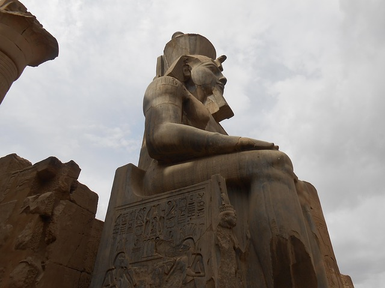
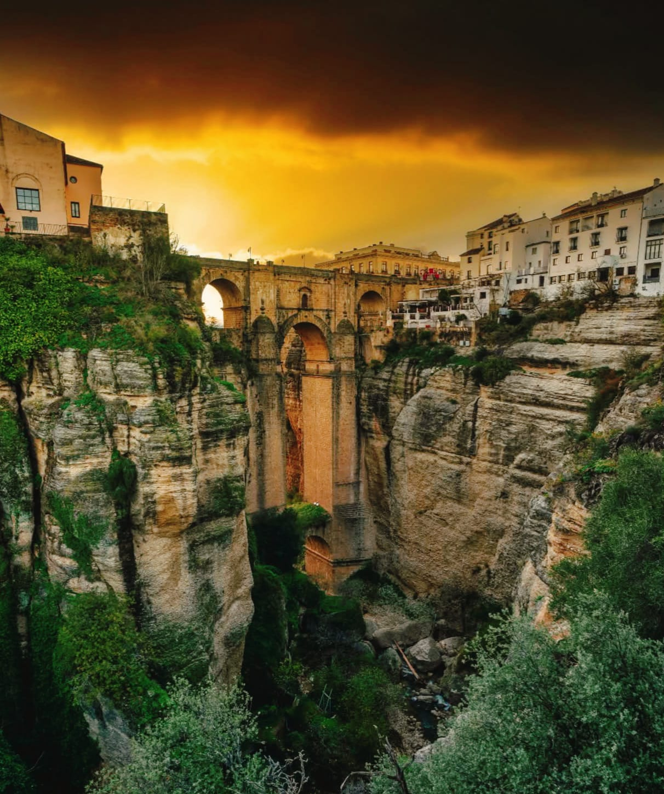

# ✈️ NTC Travels & Dreams

<div align="center">


### *Experiencias de viaje extraordinarias que transforman vidas*

[](https://www.ntcluxurytravels.com)
[](https://wa.me/14086090027)
[](https://www.ntcluxurytravels.com)

---

**Agencia de viajes boutique especializada en itinerarios personalizados y experiencias de lujo**

</div>

---

## 🌍 Destinos Exclusivos 2026

<table>
<tr>
<td align="center" width="25%">

<br><strong>🇪🇬 Egipto en Dahabiya</strong>
<br><sub>11 días | Sept 16-26</sub>
<br><code>$4,190 USD</code>
</td>
<td align="center" width="25%">

<br><strong>🇮🇳 Incredible India</strong>
<br><sub>12 días | Abr 22 - May 3</sub>
<br><code>$4,390 USD</code>
</td>
<td align="center" width="25%">

<br><strong>🇪🇸 Andalucía Journey</strong>
<br><sub>12 días | May 5-16</sub>
<br><code>€4,290 EUR</code>
</td>
<td align="center" width="25%">

<br><strong>🍷 Spanish Wine Expedition</strong>
<br><sub>Fechas flexibles</sub>
<br><code>$3,950 USD (grupo 10)</code>
</td>
</tr>
</table>

---

## ✨ Características Técnicas

### 🎯 SEO & Posicionamiento
- **Meta tags optimizados** — Open Graph, Twitter Cards, geo-targeting por destino
- **Schema.org estructurado** — TouristTrip, BreadcrumbList, FAQPage para rich snippets
- **Keywords long-tail** — Posicionamiento orgánico en múltiples idiomas
- **Sitemap XML** — Indexación optimizada para Google y Bing

### ♿ Accesibilidad (WCAG 2.1 AA+)
- **Skip-to-content** — Navegación por teclado mejorada
- **ARIA labels completos** — Soporte para lectores de pantalla
- **Jerarquía semántica** — Estructura HTML correcta
- **Preferencias de usuario** — Soporte para reduced-motion y high-contrast

### ⚡ Rendimiento & Core Web Vitals
- **Preload & Preconnect** — Carga anticipada de recursos críticos
- **DNS Prefetch** — Resolución anticipada de dominios externos
- **Lazy Loading** — Imágenes y contenido diferido
- **Scripts Deferred** — JavaScript no bloqueante

### 🎨 Diseño & UX
- **Bootstrap 5.0.0** — Sistema de grid responsivo
- **Font Awesome 5.15** — Iconografía consistente
- **Google Fonts** — Montserrat + Inter optimizadas
- **Particles.js** — Efectos visuales dinámicos

---

## 📁 Estructura del Proyecto

```
NTC/
├── 📄 index.html              # Página principal
├── 📄 tour-egypt.html         # Tour Egipto en Dahabiya
├── 📄 tour-india.html         # Tour Incredible India
├── 📄 tour-andalucia.html     # Tour Andalucía Journey
├── 📄 tour-spain-wine.html    # Tour Spanish Wine Expedition
├── 📁 css/
│   ├── style.css              # Estilos principales
│   ├── accessibility.css      # Estilos WCAG
│   └── ntc-plugins.css        # Plugins y componentes
├── 📁 js/
│   ├── main.js                # JavaScript principal + WhatsApp handlers
│   ├── custom-swiper.js       # Carruseles
│   ├── custom-nav.js          # Navegación
│   └── particlerun.js         # Efectos de partículas
├── 📁 images/
│   ├── andalucia/             # Imágenes tour Andalucía
│   ├── egipto/                # Imágenes tour Egipto
│   ├── india/                 # Imágenes tour India
│   └── ...
└── 📁 favicon/                # Iconos y manifest
```

---

## 🚀 Tecnologías

<div align="center">


</div>

---

## 📞 Contacto

<div align="center">

| Canal | Información |
|-------|-------------|
| 🌐 **Website** | [www.ntcluxurytravels.com](https://www.ntcluxurytravels.com) |
| 📱 **WhatsApp** | [+1 408-609-0027](https://wa.me/14086090027) |
| 📧 **Email** | info@ntcluxurytravels.com |

</div>

---

<div align="center">

**© 2026 NTC Travels & Dreams. Todos los derechos reservados.**

*Diseñado con ❤️ para viajeros que buscan experiencias únicas*

Powered by [AVALON](https://www.avalon.com)

</div>
